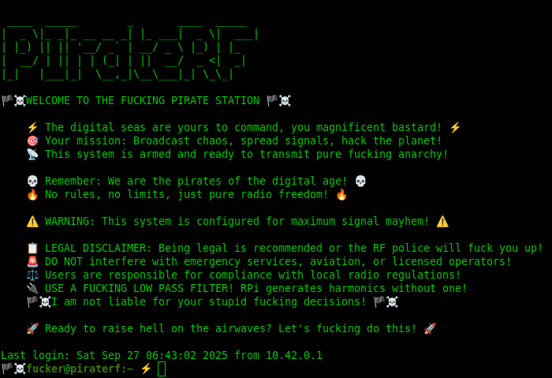
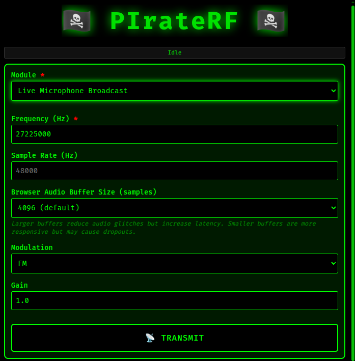
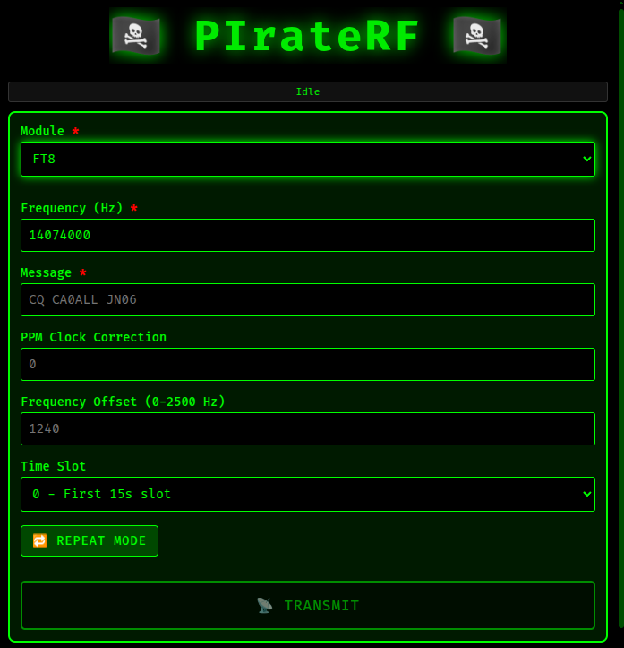
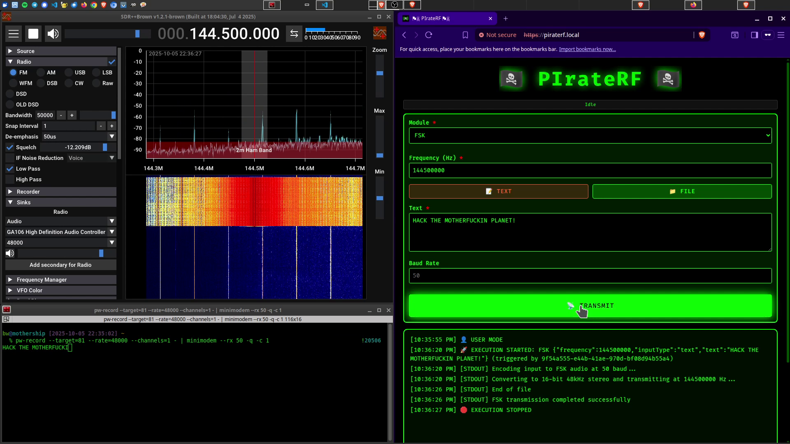
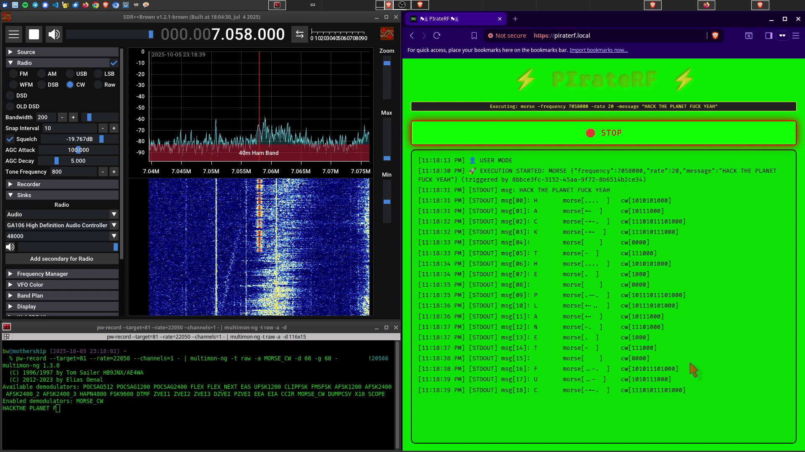

# 🏴‍☠️ PIrateRF - Software-Defined Radio Transmission Platform



**PIrateRF** transforms your **Raspberry Pi Zero W** into a portable RF signal generator that spawns its own WiFi hotspot. Control everything from FM broadcasts to digital modes through your browser - hack the airwaves from anywhere! 📡⚡

## 📋 Table of Contents

- [🎯 11 Different Transmission Modes](#-11-different-transmission-modes)
- [🚀 Quick Setup Guide](#-quick-setup-guide)
  - [Prerequisites](#prerequisites)
  - [Option 1: Pre-Built Image (Recommended)](#option-1-pre-built-image-recommended)
  - [Option 2: Manual Build Setup](#option-2-manual-build-setup)
    - [🚨 IMPORTANT: Pi Zero Setup First!](#-important-pi-zero-setup-first)
    - [1. Initial Setup](#1-initial-setup)
    - [2. Complete Pi Setup](#2-complete-pi-setup)
    - [3. Connect and Use](#3-connect-and-use)
  - [🎉 Pirate Crew Mode](#-pirate-crew-mode)
- [🔌 Antenna Setup](#-antenna-setup)
- [📡 Transmission Modes Explained](#-transmission-modes-explained)
  - [🎵 FM Station](#-fm-station)
  - [🎙️ Live Microphone Broadcast](#️-live-microphone-broadcast)
  - [📟 FT8](#-ft8)
  - [📠 RTTY](#-rtty)
  - [📊 FSK](#-fsk)
  - [📱 POCSAG](#-pocsag)
  - [📻 Morse Code](#-morse-code)
  - [🎛️ Carrier Wave](#️-carrier-wave)
  - [🌊 Frequency Sweep](#-frequency-sweep)
  - [📺 SSTV](#-sstv)
  - [🎨 Spectrum Paint](#-spectrum-paint)
- [🛠️ Development Commands](#️-development-commands)
  - [Local Development](#local-development)
  - [Pi Management](#pi-management)
- [📁 Project Structure](#-project-structure)
- [🏴‍☠️ Legal and Safety Notice](#️-legal-and-safety-notice)
  - [Amateur Radio License Required](#amateur-radio-license-required)
  - [Frequency Regulations](#frequency-regulations)
  - [Hardware Requirements (for proper use)](#hardware-requirements-for-proper-use)
  - [Geographic Restrictions](#geographic-restrictions)
  - [🏠 Indoor Testing & Experimentation](#-indoor-testing--experimentation)
- [📡 Standard Operating Frequencies](#-standard-operating-frequencies)
  - [HF Amateur Bands (3-30 MHz)](#hf-amateur-bands-3-30-mhz)
  - [VHF/UHF Amateur Bands](#vhfuhf-amateur-bands)
  - [FT8 Standard Frequencies (USB mode)](#ft8-standard-frequencies-usb-mode)
  - [RTTY Standard Frequencies (USB mode)](#rtty-standard-frequencies-usb-mode)
  - [SSTV Standard Frequencies](#sstv-standard-frequencies)
  - [FM Repeater Standard Splits](#fm-repeater-standard-splits)
- [🔗 Core Dependencies](#-core-dependencies)
- [📝 License](#-license)
- [TODO](#todo)

## 🎯 11 Different Transmission Modes

- **🎵 FM Station** - Full FM broadcasting with RDS metadata, playlists, and audio processing
- **🎙️ Live Microphone Broadcast** - Real-time microphone streaming with configurable modulation (AM/DSB/USB/LSB/FM/RAW)
- **📟 FT8** - Long-range digital mode for weak-signal communication on HF bands
- **📠 RTTY** - Radio teletype using Baudot code and FSK modulation
- **📊 FSK** - Frequency Shift Keying for digital data transmission
- **📱 POCSAG** - Digital pager messaging system
- **📻 Morse Code** - CW transmission with configurable WPM
- **🎛️ Carrier Wave** - Simple carrier generation for testing
- **🌊 Frequency Sweep** - RF sweeps for antenna testing and analysis
- **📺 SSTV** - Slow Scan Television image transmission
- **🎨 Spectrum Paint** - Convert images to RF spectrum art

All controlled through a **standalone WiFi access point** - connect any device and start transmitting like the RF rebel you were meant to be! Perfect for international waters operations and regions with more... flexible spectrum policies.

## 🚀 Quick Setup Guide

### Prerequisites

- **Raspberry Pi Zero W** with 4GB+ SD card

### Option 1: Pre-Built Image (Recommended)

Skip all the build bullshit and get straight to RF chaos:

1. **Download** the pre-built image: [PIrateRF Image v2025-10-06](https://archive.org/download/piraterf-2025-10-06-12-19-14-20251006092641/piraterf_2025-10-06_12-19-14.img)
2. **Flash** to SD card using:
   - **Raspberry Pi Imager** (recommended): Select "Use custom image" and choose the downloaded `.img` file
   - **Command line**: `sudo dd if=piraterf_2025-10-06_12-19-14.img of=/dev/sdX bs=4M status=progress` (replace `/dev/sdX` with your SD card)
3. **Boot** the Pi Zero W and connect to WiFi: "🏴‍☠️📡" (password: "FUCKER!!!")
4. **Open browser**: `https://piraterf.local` and start transmitting immediately!

**Default Settings:**

- **WiFi AP**: SSID "🏴‍☠️📡", Password "FUCKER!!!"
- **SSH Access**: User `fucker`, Password `FUCKER`, Hostname `piraterf.local`
- **Web Interface**: https://piraterf.local

### Option 2: Manual Build Setup

### 🚨 IMPORTANT: Pi Zero Setup First!

**Before you do ANYTHING else**, get your fucking Pi Zero W connected and accessible via SSH. Follow this tutorial that actually works:

👉 **[Pi Zero W USB Connection Tutorial](https://ciprian.51k.eu/pi-zero-1-wh-ubuntu-24-04-usb-connection-the-tutorial-that-actually-fkin-works/)**

This will get your Pi Zero connected via USB with SSH access so you can actually deploy PIrateRF to the little bastard.

**🌐 INTERNET SHARING REQUIRED**: After USB connection is working, you MUST share internet from your computer to the Pi Zero. The setup scripts need to download packages and dependencies - no internet, no RF chaos.

**Set up internet sharing on Ubuntu/Linux**:

1. **Set connection to shared**: In Ubuntu Network Settings, find the USB connection (usually `usb0`), click on it, go to IPv4 settings, and change the method from "Link-Local Only" to "Shared to other computers"

2. **Stop Docker services** (they interfere with networking):

```bash
sudo systemctl stop docker.socket
sudo systemctl stop docker
```

3. **Restart NetworkManager**:

```bash
sudo systemctl restart NetworkManager
```

4. **Configure iptables rules** (replace `usb0` and `enp5s0` with your actual interfaces):

```bash
sudo iptables -A FORWARD -i usb0 -o enp5s0 -j ACCEPT
sudo iptables -A FORWARD -i enp5s0 -o usb0 -j ACCEPT
sudo iptables -t nat -A POSTROUTING -s 10.42.0.0/24 -o enp5s0 -j MASQUERADE
```

5. **Test it**: SSH into your Pi with `ssh fucker@piraterf.local` (or whatever user@host.local you set up) and run `ping 8.8.8.8` - if it works, you're ready to cause some RF mayhem!

**Find your interfaces**: Use `ip link show` to see `usb0` (Pi connection) and your main internet interface.

### 1. Initial Setup

```bash
# Clone the repository
git clone https://github.com/psyb0t/piraterf.git
cd piraterf

# Configure your Pi settings
nano scripts/pi_config.sh
# Set: PI_USER, PI_HOST, PI_PASS, AP_SSID, AP_PASSWORD
```

**Example configuration** (modify to match your Pi setup):

```bash
PI_USER="fucker"                # Pi username
PI_HOST="piraterf.local"        # Pi hostname/IP
PI_PASS="FUCKER"                # Pi password

AP_SSID="🏴‍☠️📡"               # WiFi AP name
AP_PASSWORD="FUCKER!!!"         # WiFi AP password
AP_CHANNEL="7"                  # WiFi channel (1-14)
AP_COUNTRY="US"                 # Country code
```

### 2. Complete Pi Setup

```bash
# Run the full automated setup
make pi
```

This command will:

- Install rpitx and dependencies
- Configure WiFi access point
- Build and deploy PIrateRF
- Install systemd service
- Reboot into full pirate mode 🏴‍☠️

### 3. Connect and Use

1. Connect to WiFi: Your configured SSID (default: "🏴‍☠️📡")
2. Open browser: `https://piraterf.local`
3. Select transmission mode and start broadcasting like a proper RF pirate!

### 🎉 Pirate Crew Mode

Connect multiple devices to the PIrateRF access point and all access the web interface simultaneously! While only one transmission can run at a time (because GPIO doesn't fucking share), all connected devices see real-time transmission status, output logs, and can take turns controlling the RF transmissions. Perfect for fucking around with friends in a radio wave gangbang! 📡💥

**Multi-Device Features:**

- **Shared Control**: Any device can start/stop transmissions
- **Live Status**: All devices see real-time transmission progress
- **Output Streaming**: Live RF transmission logs visible to everyone
- **Turn-Based Chaos**: Pass control between devices for collaborative broadcasting

## 🔌 Antenna Setup

Connect your antenna to **GPIO 4 (Physical Pin 7)** on the Pi Zero W:

- **No antenna**: Extremely weak signal contained within your home - perfect for safe chaos without pissing off the neighbors
- **Short wire (10-20cm)**: Minimal range for indoor experimentation
- **Wire antenna (75cm)**: Longer range but square wave harmonics travel farther than intended - keep this shit indoors
- **Low-pass filter + antenna**: For proper outdoor transmission (get your fucking license first)
- **Low-pass filter + amplifier + antenna**: For maximum range and maximum chaos (Pi outputs milliwatts by default)

**⚠️ WARNING**: The Raspberry Pi GPIO outputs square waves with harmonics across the entire spectrum. For proper outdoor transmission, you MUST use appropriate low-pass filters to suppress spurious emissions and comply with RF regulations. Without filtering, you're broadcasting on multiple frequencies simultaneously.

## 📡 Transmission Modes Explained

### 🎵 FM Station


Full FM broadcasting with RDS support:

**Configuration Options:**

- **Frequency**: Transmission frequency in MHz
- **Audio File**: Upload MP3/WAV/FLAC/OGG or select processed files
  > **Upload Process**: Files automatically converted via FFmpeg to 48kHz/16-bit/mono WAV format and saved to `./files/audio/uploads/`
- **Playlist Builder**: UI tool to combine multiple audio files and SFX into a single WAV using Sox
- **RDS Settings**:
  - **PI Code**: 4-character station identifier
  - **PS Name**: 8-character station name
  - **Radio Text**: 64-character scrolling message
- **Play Mode**: Toggle between "play once" and "loop"
- **Intro/Outro**: Intro and outro SFX tracks
- **PPM Clock Correction**: Fine-tune frequency accuracy
- **Timeout**: Auto-stop after specified seconds (0 = no timeout)
- **Microphone Recording**: Record audio directly through browser interface and save as WAV

**Reception:**

- **Demodulation**: WFM (wideband FM)
- **RDS Signal**: The transmission includes three visible signals:
  - Main signal: Contains the audio/music
  - Two parallel RDS signals: Located at a fixed frequency offset from the main carrier, containing station metadata
- **RDS Decoding**: SDR++ (sdrpp-brown fork) includes a built-in RDS decoder (no plugins required) that can decode the PI code, PS name, and radio text

**Applications:** Underground radio broadcasting, music streaming, podcasting, community radio, pirate radio stations, rickrolling entire neighborhoods


### 🎙️ Live Microphone Broadcast



Real-time microphone streaming with configurable modulation:

**Configuration Options:**

- **Frequency**: Transmission frequency in Hz
- **Sample Rate**: Audio sample rate (default 48000 Hz)
- **Buffer Size**: Browser audio buffer (1024-16384 samples)
  - 1024: Low latency, may glitch
  - 4096: Default balanced setting
  - 16384: Max quality, higher latency
- **Modulation**: AM, DSB, USB, LSB, FM, RAW (note: USB/LSB are slow on Pi Zero)
- **Gain**: Audio gain multiplier (default 1.0)
- **Real-time processing**: Browser captures microphone, streams via WebSocket into unix socket that gets piped to rpitx

**Reception:**

- **Demodulation**: Use the same modulation mode you selected for transmission (AM, DSB, USB, LSB, FM, or RAW)

**Applications:** Live commentary, emergency communications, amateur radio nets, real-time broadcasting, broadcast your burps, go live on radio while in the moshpit


### 📟 FT8



Ultra-weak signal digital mode for HF DX:

**Configuration Options:**

- **Frequency**: Base frequency in Hz (e.g., 14074000 for 20m)
- **Message**: FT8 message text (e.g., "CQ CA0ALL JN06")
- **PPM Clock Correction**: Fine-tune frequency accuracy
- **Frequency Offset**: 0-2500 Hz within FT8 sub-band (default 1240)
- **Time Slot**: Choose 15-second transmission slot (0, 1, or 2)
- **Repeat Mode**: Continuous transmission every 15 seconds

**Reception:**

- **Demodulation**: USB mode
- **Decoding**: SDR++ (sdrpp-brown fork) has a built-in FT8 decoder module that works when tuned to standard FT8 frequencies (e.g., 14.074 MHz)
- **⚠️ LICENSE WARNING**: DO NOT transmit FT8 without a valid amateur radio call sign - FT8 messages contain call signs and transmitting without one is direct call sign spoofing and highly illegal

**Applications:** Long-range DX contacts, weak signal communication, intercontinental contacts, confusing the fuck out of contesters


### 📠 RTTY


Classic digital text communication:

**Configuration Options:**

- **Frequency**: Transmission frequency in Hz
- **Space Frequency**: FSK space frequency offset (default 170 Hz)
- **Message**: Text to transmit

**Reception:**

- **Demodulation**: USB mode
- **Decoding with fldigi**:
  - Set fldigi to RTTY mode
  - Configure shift to match your space frequency (default: 45.45/170 or your selected space frequency)
  - Configure fldigi audio input to use PulseAudio monitor of your SDR software output (SDR++, GQRX, SDRSharp, SDRAngel, etc.)

**Applications:** Digital text communication, news bulletins, teletype messaging, sending ASCII art over RTTY


### 📊 FSK


Binary frequency shift keying for data transmission:

**Configuration Options:**

- **Frequency**: Transmission frequency in Hz
- **Input Type**: Text or file mode
  - **Text Mode**: Direct text input
  - **File Mode**: Upload data files (any format)
    > **Upload Process**: Files moved as-is (no conversion) to `./files/data/uploads/` preserving original extension
- **Baud Rate**: Transmission speed (default 50 baud for reliability)

**Reception:**

- **Demodulation**: FM mode
- **Decoding with minimodem**:
  ```bash
  pw-record --target=81 --rate=48000 --channels=1 - | minimodem --rx 50 -q -c 1
  ```
  **Note**: `pw-record --target=81` captures audio from the PulseAudio monitor sink (your SDR software output). Change the `--rx` parameter to match your selected baud rate. Current implementation works best with 50-100 baud rates.

**Applications:** Digital bulletins, file transfer, packet radio, data transmission, amateur radio digital modes, sending porn like back in the dialup days



### 📱 POCSAG


Digital pager messaging system:

**Configuration Options:**

- **Frequency**: Transmission frequency in Hz
- **Baud Rate**: 512, 1200 (default), or 2400 bps
- **Function Bits**: 0-3 (default 3) for message type
- **Repeat Count**: Number of transmission repeats (default 4)
- **Numeric Mode**: Toggle for numeric-only messages
- **Invert Polarity**: Signal polarity inversion
- **Debug Mode**: Enable debug output
- **Multiple Messages**: Support for batch message transmission

**Reception:**

- **Demodulation**: FM mode
- **Decoding with multimon-ng**:
  ```bash
  pw-record --target=81 --rate=22050 --channels=1 - | multimon-ng -t raw -a POCSAG1200 -
  ```
  **Note**: `pw-record --target=81` captures audio from the PulseAudio monitor sink (your SDR software output). Change the multimon-ng mode based on your selected baud rate:
  - 512 baud: `-a POCSAG512`
  - 1200 baud: `-a POCSAG1200`
  - 2400 baud: `-a POCSAG2400`

**Applications:** Emergency paging systems, alert notifications, pager messaging, mass notification chaos, 90s nostalgia bombing


### 📻 Morse Code


Traditional CW transmission:

**Configuration Options:**

- **Frequency**: Transmission frequency in Hz
- **Rate**: Transmission speed in dits per minute (default 20)
- **Message**: Text to convert to Morse code

**Reception:**

- **Demodulation**: CW mode
- **Decoding with multimon-ng**:
  ```bash
  pw-record --target=81 --rate=22050 --channels=1 - | multimon-ng -t raw -a MORSE_CW -d 60 -g 60 -
  ```
  **Note**: `pw-record --target=81` captures audio from the PulseAudio monitor sink (your SDR software output). The `-d` (delay) and `-g` (gain) parameters should be adjusted based on your transmission rate (dits per minute). Higher rates require lower delay values, lower rates need higher delay values for proper decoding.

**Applications:** Morse code practice, beacon transmissions, emergency communications, sending dirty messages in CW, beacon spam



### 🎛️ Carrier Wave


Simple carrier generation for testing:

**Configuration Options:**

- **Frequency**: Carrier frequency in Hz
- **PPM Clock Correction**: Fine-tune frequency accuracy

**Reception:**

- **Demodulation**: RAW mode
- **Signal**: Simple continuous wave at the specified frequency

**Applications:** Antenna tuning, transmitter testing, SWR measurements, dead carrier trolling, RF circuit testing


### 🌊 Frequency Sweep


Automated frequency sweeps for RF analysis:

**Configuration Options:**

- **Center Frequency**: Center frequency in Hz
- **Bandwidth**: Sweep bandwidth in Hz (default 1 MHz)
- **Sweep Duration**: Time for complete sweep in seconds (default 5.0)

**Reception:**

- **Demodulation**: RAW mode
- **Watch**: The active carrier frequency sweep from left to right across your waterfall display

**Applications:** Antenna analysis, filter testing, frequency response measurements, wobbulating like a maniac, antenna torture testing


### 📺 SSTV


Slow Scan Television image transmission:

**Configuration Options:**

- **Frequency**: Transmission frequency in Hz
- **Picture File**: Upload or select image file
  > **Upload Process**: Images converted via ImageMagick to RGB 320x256 format (.rgb extension) for SSTV transmission, saved to `./files/images/uploads/` (spectrum paint .Y files also available if previously uploaded)

**Reception:**

- **Demodulation**: USB mode
- **SSTV Mode**: Martin 1
- **Decoding**: Can be decoded using QSSTV or other SSTV software
- **⚠️ UNVERIFIED**: The author has attempted decoding with QSSTV but has not successfully received images yet. The rpitx SSTV module is trusted to generate proper Martin 1 signals. If you successfully decode SSTV transmissions from PIrateRF, please open a PR describing your setup and decoding process!

**Applications:** Image transmission over radio, amateur radio SSTV, visual communication, cock pic broadcasting - look at that big ass rooster

### 🎨 Spectrum Paint


Convert images to RF spectrum art:

**Configuration Options:**

- **Frequency**: Base transmission frequency in Hz
- **Picture File**: Upload or select image file
  > **Upload Process**: Images converted via ImageMagick to YUV format (.Y extension) for spectrum paint AND RGB 320x256 format (.rgb extension) for SSTV, both saved to `./files/images/uploads/`
- **Excursion**: Frequency deviation in Hz (default 100000)

**Reception:**

- **Demodulation**: RAW mode
- **Waterfall Settings**: Set waterfall display to full resolution (no filtering, show all spectrum peaks not just the highs) to see the complete image painted across the spectrum

**Applications:** RF spectrum art, spectrum visualization, signal analysis demonstrations, drawing dick pics on waterfalls, spectrum graffiti


## 🛠️ Development Commands

### Local Development

```bash
make run-dev          # Run locally with development setup
make build            # Cross-compile for Pi Zero ARM
make lint-fix         # Format and lint code
make test-coverage    # Run tests with coverage
```

### Pi Management

```bash
make pi               # Complete automated setup
make deploy           # Deploy to Pi
make install          # Install systemd service
make ssh              # SSH into Pi
make pi-reboot        # Reboot Pi
make uninstall        # Remove from Pi
make pi-image         # Clone and shrink Pi SD card image
```

## 📁 Project Structure

```
piraterf/
├── cmd/                    # Application entry points
├── internal/pkg/services/
│   └── piraterf/          # Core service implementation
│       ├── http_server.go # Web server and API
│       ├── websocket*.go  # Real-time communication
│       ├── audio_*.go     # Audio processing
│       ├── image_*.go     # Image processing
│       └── execution_*.go # RF transmission management
├── scripts/               # Setup and deployment scripts
├── html/                  # Web interface templates
├── static/                # Frontend assets (CSS/JS/images)
├── files/                 # Audio, image, and data storage
└── uploads/              # Temporary upload staging
```

## 🏴‍☠️ Legal and Safety Notice

**⚠️ IMPORTANT LEGAL REQUIREMENTS ⚠️**

### Amateur Radio License Required

- **Most frequencies require an amateur radio license**
- FT8, RTTY, FSK, SSTV, and most HF/VHF/UHF operations need proper licensing
- Check your local amateur radio authority (FCC/Ofcom/etc.) for license requirements

### Frequency Regulations

- **Stay within amateur bands**: Use only frequencies allocated to amateur radio
- **Power limits**: Pi Zero outputs only a few milliwatts - if using an amplifier, respect maximum power limitations for your license class
- **Spurious emissions**: Always use appropriate low-pass filters
- **No commercial content**: Amateur radio prohibits business communications

### Hardware Requirements (for proper use)

- **Low-pass filters mandatory**: Pi GPIO outputs square waves with harmonics across the spectrum
- **Proper antenna**: Use resonant antennas for your operating frequency
- **Power output**: Pi Zero GPIO outputs only a few milliwatts - if you want more range, you'll need a proper amplifier and low-pass filter
- **SWR monitoring**: At milliwatt power levels the Pi doesn't give a fuck about SWR, but if you're using an amplifier you need proper impedance matching or you'll fry your amp

### Geographic Restrictions

- **Band plans vary by country**: US/European/Asian amateur allocations differ
- **Power limits vary**: Check local regulations for your license class
- **Emergency frequencies**: Never interfere with emergency/public safety communications

### 🏠 Indoor Testing & Experimentation

- **No antenna = minimal range**: Without a proper antenna, signals are extremely weak and contained within your home
- **Testing and learning**: Perfect for understanding RF concepts, digital modes, and software functionality
- **Protocol development**: Test encoding/decoding without external transmission
- **Educational use**: Learn about modulation, filtering, and signal processing safely indoors

**PIrateRF is designed for amateur radio experimentation and education - including safe indoor testing without external antennas. Built for engineers who understand that good RF practices matter more than arbitrary administrative boundaries. Users are responsible for compliance with all local RF regulations and licensing requirements.**

## 📡 Standard Operating Frequencies

PIrateRF supports the full amateur radio spectrum. Here are common frequencies for each mode:

### HF Amateur Bands (3-30 MHz)

- **80m**: 3.5-4.0 MHz | **40m**: 7.0-7.3 MHz | **30m**: 10.1-10.15 MHz
- **20m**: 14.0-14.35 MHz | **17m**: 18.068-18.168 MHz | **15m**: 21.0-21.45 MHz
- **12m**: 24.89-24.99 MHz | **10m**: 28.0-29.7 MHz

### VHF/UHF Amateur Bands

- **2m**: 144-148 MHz (FM: 144.0-148.0 MHz, Repeaters: 146.0-148.0 MHz out)
- **1.25m**: 222-225 MHz | **70cm**: 420-450 MHz (Repeaters: 440-450 MHz out)

### FT8 Standard Frequencies (USB mode)

- **80m**: 3.573 MHz | **40m**: 7.074 MHz | **30m**: 10.136 MHz
- **20m**: 14.074 MHz | **17m**: 18.100 MHz | **15m**: 21.074 MHz | **10m**: 28.074 MHz

### RTTY Standard Frequencies (USB mode)

- **80m**: 3.580-3.600 MHz | **40m**: 7.035-7.045 MHz | **30m**: 10.130-10.150 MHz
- **20m**: 14.070-14.099 MHz | **15m**: 21.070-21.100 MHz | **10m**: 28.070-28.120 MHz

### SSTV Standard Frequencies

- **80m**: 3.736 MHz (LSB) | **40m**: 7.055 MHz (LSB)
- **20m**: 14.233 MHz (USB) | **15m**: 21.343 MHz (USB) | **10m**: 28.667 MHz (USB)
- **2m**: 144.55 MHz (FM)

### FM Repeater Standard Splits

- **2m**: Input 144-146 MHz, Output 146-148 MHz (0.6 MHz split)
- **70cm**: Input 420-430 MHz, Output 440-450 MHz (5 MHz split)

## 🔗 Core Dependencies

- **[rpitx](https://github.com/F5OEO/rpitx)** - RF transmission library for Raspberry Pi GPIO
- **[gorpitx](https://github.com/psyb0t/gorpitx)** - Go wrapper providing clean API for rpitx
- **[servicepack](https://github.com/psyb0t/servicepack)** - Development and deployment framework
- **[aichteeteapee](https://github.com/psyb0t/aichteeteapee)** - HTTP server with WebSocket support

## 📝 License

This project is licensed under WTFPL (Do What The Fuck You Want To Public License).

## TODO

- (gorpitx) Add 1 extra second of carrier to RTTY transmission

- (gorpitx) Ditch minimodem in FSK and use smth else

- (gorpitx) Fix word spacing in morse code

- Actually prove SSTV works (tried with qsstv and various settings + various listeners and nope can't do it)

**🏴‍☠️ Now get out there and start broadcasting like the RF pirate you were meant to be! 📡**

_Remember: With great RF power comes great responsibility. Always operate legally and don't be a dick to other operators._

---

_Built with spite using https://github.com/psyb0t/servicepack_

---
